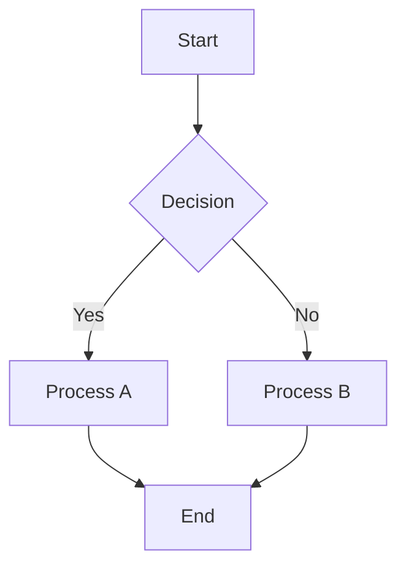
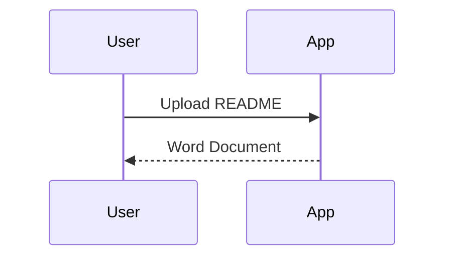

# README to Word Converter

[](https://github.com/vishalm/readme2readall/actions/workflows/ci.yml)
[](https://github.com/vishalm/readme2readall/actions/workflows/release.yml)
[](https://github.com/vishalm/readme2readall/actions/workflows/docker.yml)
[](https://github.com/vishalm/readme2readall/actions/workflows/codeql.yml)
[](https://badge.fury.io/py/readme2word)
[](https://www.python.org/downloads/)
[](https://opensource.org/licenses/MIT)

A powerful Python package that converts README.md files to professional Word documents with full support for Mermaid diagrams, tables, and advanced formatting.

## 📋 Table of Contents

- [✨ Features](#-features)
- [🚀 Quick Start](#-quick-start)
  - [Installation](#installation)
  - [Command Line Usage](#command-line-usage)
  - [Web Interface](#web-interface)
- [🎨 Mermaid Diagram Support](#-mermaid-diagram-support)
- [📦 Installation Options](#-installation-options)
- [🔧 CLI Reference](#-cli-reference)
- [🐳 Docker Usage](#-docker-usage)
- [☸️ Kubernetes Deployment](#️-kubernetes-deployment)
- [🧪 Development](#-development)
- [📚 Examples](#-examples)
- [🔧 Configuration](#-configuration)
- [📋 Requirements](#-requirements)
- [🚀 CI/CD Pipeline](#-cicd-pipeline)
- [🐛 Troubleshooting](#-troubleshooting)
- [🤝 Contributing](#-contributing)
- [📄 License](#-license)
- [🔗 Links](#-links)
- [🙏 Acknowledgments](#-acknowledgments)
- [📊 Project Stats](#-project-stats)

## ✨ Features

- 📄 **Markdown to Word**: Convert README.md files to professional .docx documents
- 🎨 **Mermaid Diagrams**: Automatic conversion of Mermaid diagrams to embedded images
- 📊 **Rich Content**: Tables, code blocks, images, and formatting preservation
- 🖥️ **Web Interface**: Beautiful Streamlit-based UI with light/dark themes
- 🔧 **CLI Tool**: Command-line interface for batch processing
- 🐳 **Docker Ready**: Complete containerization support
- ☸️ **Kubernetes**: Production-ready Helm charts included
- 🚀 **CI/CD**: Comprehensive GitHub Actions pipeline

## 🚀 Quick Start

### Installation

```bash
# Install from PyPI
pip install readme2word

# Install with all extras (recommended)
pip install readme2word[all]

# Install for development
pip install readme2word[dev]
```

### Command Line Usage

```bash
# Convert README.md to Word document
readme2word README.md

# Convert with custom output name
readme2word README.md -o report.docx

# Use dark theme for diagrams
readme2word README.md --theme dark

# Launch web interface
readme2word --web
```

### Web Interface

```bash
# Launch web interface
readme2word --web

# Or using Docker
docker run -p 8501:8501 ghcr.io/vishalm/readme2readall:latest
```

Then open your browser to `http://localhost:8501`

## 🎨 Mermaid Diagram Support

The converter automatically detects and converts Mermaid diagrams:

### Flowcharts


### Sequence Diagrams


### Supported Themes
- `default` - Standard Mermaid colors
- `neutral` - Clean black and white
- `dark` - Dark theme with light text
- `forest` - Green-themed styling

## 📦 Installation Options

### Basic Installation
```bash
pip install readme2word
```

### With Optional Dependencies
```bash
# Development tools
pip install readme2word[dev]

# Docker support
pip install readme2word[docker]

# Kubernetes support
pip install readme2word[kubernetes]

# Everything
pip install readme2word[all]
```

## 🔧 CLI Reference

```
usage: readme2word [-h] [-o OUTPUT] [--theme {default,neutral,dark,forest}] 
                   [--debug] [--no-toc] [--web] [--version] [input_file]

Convert README.md files to professional Word documents

positional arguments:
  input_file            Input README.md file to convert

optional arguments:
  -h, --help            show this help message and exit
  -o OUTPUT, --output OUTPUT
                        Output Word document filename
  --theme {default,neutral,dark,forest}
                        Mermaid diagram theme (default: default)
  --debug               Enable debug mode with verbose logging
  --no-toc              Disable table of contents generation
  --web                 Launch web interface instead of CLI conversion
  --version             show program's version number and exit
```

## 🐳 Docker Usage

### Using Pre-built Images

```bash
# Pull from GitHub Container Registry
docker pull ghcr.io/vishalm/readme2readall:latest

# Run web interface
docker run -p 8501:8501 ghcr.io/vishalm/readme2readall:latest

# Convert files with volume mount
docker run -v $(pwd):/workspace ghcr.io/vishalm/readme2readall:latest readme2word /workspace/README.md
```

### Using Docker Compose

```bash
# Production mode
docker-compose up

# Development mode
docker-compose --profile dev up readme2word-dev
```

## ☸️ Kubernetes Deployment

### Using Helm

```bash
# Install with default values
helm install readme2word ./infra/helm/readme2word

# Install with custom values
helm install readme2word ./infra/helm/readme2word -f ./infra/values-prod.yaml

# Upgrade deployment
helm upgrade readme2word ./infra/helm/readme2word
```

### Using kubectl

```bash
# Apply manifests
kubectl apply -f infra/samples/prod-manifests.yaml

# Check deployment status
kubectl get pods -l app=readme2word
```

## 🧪 Development

### Local Development Setup

```bash
# Clone repository
git clone https://github.com/vishalm/readme2readall.git
cd readme2readall

# Create virtual environment
python -m venv venv
source venv/bin/activate  # On Windows: venv\Scripts\activate

# Install in development mode
pip install -e .[dev]

# Run tests
pytest tests/

# Run web interface
streamlit run app.py
```

### Available Make Commands

```bash
# Development
make install          # Install dependencies
make setup-dev        # Setup development environment
make test             # Run all tests
make test-quick       # Run quick tests

# Package Management
make package-build    # Build Python package
make package-validate # Validate package structure
make publish-test     # Publish to Test PyPI
make publish-prod     # Publish to PyPI
make install-local    # Install package locally

# Docker
make build            # Build Docker image
make run              # Run in production mode
make dev              # Run in development mode
make clean            # Clean up containers and images

# Kubernetes
make k8s-deploy       # Deploy to Kubernetes
make k8s-status       # Check deployment status
make k8s-cleanup      # Remove deployment
```

## 📚 Examples

### Basic Conversion
```bash
readme2word README.md
```

### Custom Output and Theme
```bash
readme2word README.md -o technical-report.docx --theme dark
```

### Batch Processing
```bash
for file in *.md; do
    readme2word "$file" -o "${file%.md}.docx"
done
```

### Python API
```python
from readme2word import ReadmeToWordConverter

converter = ReadmeToWordConverter()

# Convert markdown content
with open('README.md', 'r') as f:
    content = f.read()

success = converter.convert(
    content=content,
    output_filename='output.docx',
    include_toc=True,
    diagram_style='default'
)

if success:
    print("✅ Conversion completed!")
```

## 🔧 Configuration

### Environment Variables
- `DEBUG`: Enable debug mode
- `MERMAID_THEME`: Default Mermaid theme
- `OUTPUT_DIR`: Default output directory

### Streamlit Configuration
The web interface can be configured via `.streamlit/config.toml`:

```toml
[server]
port = 8501
headless = true

[theme]
primaryColor = "#1f77b4"
backgroundColor = "#ffffff"
```

## 📋 Requirements

- **Python**: 3.8 or higher
- **Dependencies**: 
  - streamlit >= 1.28.0
  - python-docx >= 0.8.11
  - markdown >= 3.5.0
  - beautifulsoup4 >= 4.12.0
  - requests >= 2.31.0
  - Pillow >= 10.0.0

## 🚀 CI/CD Pipeline

This project includes a comprehensive GitHub Actions CI/CD pipeline:

- **Continuous Integration**: Multi-platform testing (Python 3.8-3.12, Ubuntu/Windows/macOS)
- **Automated Releases**: PyPI publishing on git tags
- **Docker Builds**: Multi-architecture container images
- **Security Scanning**: CodeQL analysis and dependency reviews
- **Quality Assurance**: Code formatting, linting, and type checking

See [GitHub Actions Guide](.github/GITHUB_ACTIONS_GUIDE.md) for detailed setup instructions.

## 🐛 Troubleshooting

### Common Issues

**Mermaid diagrams not converting:**
- Ensure internet connection (requires mermaid.ink API)
- Check diagram syntax at [Mermaid Live Editor](https://mermaid.live/)

**Installation issues:**
- Update pip: `pip install --upgrade pip`
- Use virtual environment: `python -m venv venv && source venv/bin/activate`

**Permission errors:**
- Use `--user` flag: `pip install --user readme2word`

### Debug Mode
```bash
readme2word README.md --debug
```

## 🤝 Contributing

We welcome contributions! Please see our [Contributing Guide](.github/CONTRIBUTING.md) for details.

### Quick Contribution Steps

1. Fork the repository
2. Create a feature branch: `git checkout -b feature/amazing-feature`
3. Make your changes and add tests
4. Run tests: `make test`
5. Commit your changes: `git commit -m 'Add amazing feature'`
6. Push to the branch: `git push origin feature/amazing-feature`
7. Open a Pull Request

## 📄 License

This project is licensed under the MIT License - see the [LICENSE](LICENSE) file for details.

## 🔗 Links

- **PyPI Package**: [https://pypi.org/project/readme2word/](https://pypi.org/project/readme2word/)
- **Docker Images**: [https://github.com/vishalm/readme2readall/pkgs/container/readme2readall](https://github.com/vishalm/readme2readall/pkgs/container/readme2readall)
- **Issues**: [https://github.com/vishalm/readme2readall/issues](https://github.com/vishalm/readme2readall/issues)
- **Discussions**: [https://github.com/vishalm/readme2readall/discussions](https://github.com/vishalm/readme2readall/discussions)

## 🙏 Acknowledgments

- **Zain Quraishi** for inspiring the idea that led to this project
- **Mermaid.js** team for the amazing diagramming tool
- **Streamlit** team for the excellent web framework
- All contributors who help improve this project

## 📊 Project Stats

- **Language**: Python 3.8+
- **Framework**: Streamlit
- **Package Manager**: pip/PyPI
- **Container**: Docker
- **Orchestration**: Kubernetes
- **CI/CD**: GitHub Actions
- **License**: MIT

---

**⭐ Star this repository** if you find it helpful!

**📦 Install now**: `pip install readme2word`