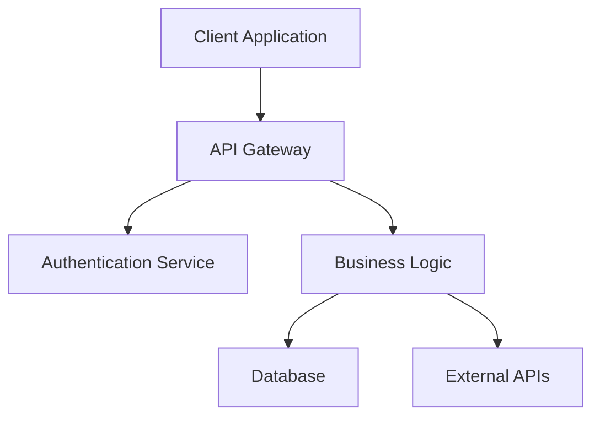
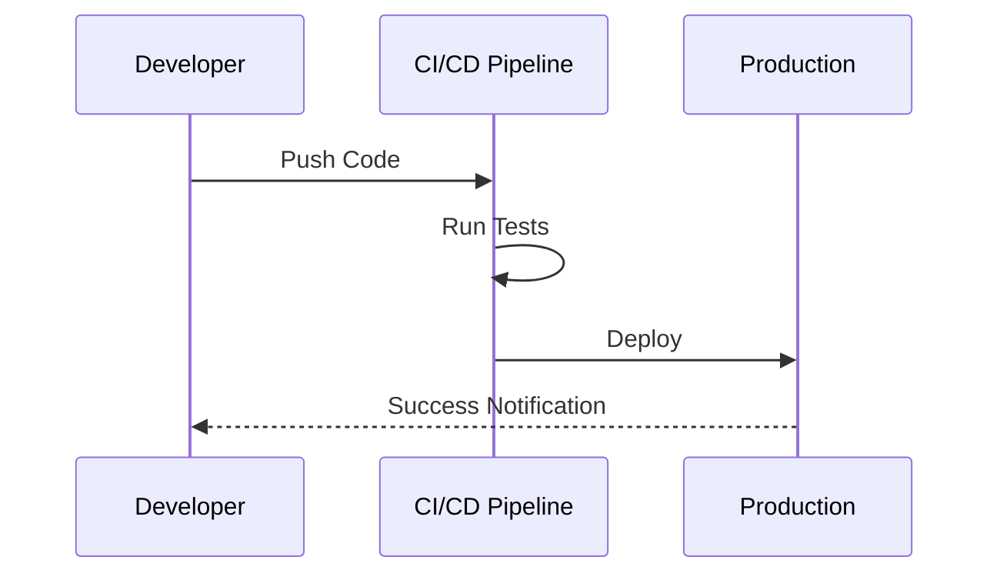

# README to Word Converter

[](https://github.com/vishalm/readme2readall/actions/workflows/ci.yml)
[](https://github.com/vishalm/readme2readall/actions/workflows/release.yml)
[](https://github.com/vishalm/readme2readall/actions/workflows/docker.yml)
[](https://github.com/vishalm/readme2readall/actions/workflows/codeql.yml)
[](https://badge.fury.io/py/readme2word)
[](https://www.python.org/downloads/)
[](https://opensource.org/licenses/MIT)

> **Transform technical documentation into professional business documents instantly**

Bridge the gap between developer-friendly Markdown and stakeholder-ready Word documents. Convert README files, technical specs, and documentation into polished, professional documents with embedded diagrams, perfect formatting, and enterprise-grade deployment options.

## 🎯 Why README to Word Converter?

### The Problem
- **Communication Gap**: Technical teams write in Markdown, business stakeholders need Word documents
- **Manual Conversion**: Time-consuming reformatting destroys productivity
- **Diagram Complexity**: Mermaid diagrams don't translate to business documents
- **Inconsistent Quality**: Manual formatting leads to unprofessional results

### The Solution
**One command. Professional results. Enterprise ready.**

```bash
pip install readme2word
readme2word README.md  # → Professional Word document with embedded diagrams
```

## 💼 Business Value

| Challenge | Solution | Impact |
|-----------|----------|---------|
| **Time to Market** | Instant document generation | 90% faster delivery |
| **Professional Quality** | Consistent, polished formatting | Enhanced stakeholder confidence |
| **Technical Communication** | Automatic diagram conversion | Clear visual communication |
| **Scalability** | Enterprise deployment options | Team-wide productivity gains |

## 🚀 Use Cases

### 🏢 Enterprise & Consulting
- **Client Deliverables**: Convert technical specs to professional proposals
- **Project Documentation**: Transform README files into executive summaries
- **API Documentation**: Business-friendly API specifications
- **Architecture Reviews**: Technical diagrams in presentation format

### 🎓 Academic & Research
- **Research Papers**: Markdown drafts to Word for collaboration
- **Thesis Documentation**: Technical content with proper academic formatting
- **Grant Proposals**: Technical specifications in funding applications
- **Course Materials**: Educational content in multiple formats

### 🔧 Development Teams
- **Release Documentation**: Professional release notes and changelogs
- **Technical Proposals**: Internal project specifications
- **Stakeholder Reports**: Progress updates in business format
- **Open Source Projects**: Professional documentation for different audiences

## ✨ Key Features

### 🎨 **Professional Document Generation**
- **Rich Formatting**: Tables, code blocks, lists with perfect preservation
- **Automatic TOC**: Generated table of contents with Word navigation
- **Custom Styling**: Professional document templates and themes
- **Image Handling**: Embedded images with automatic sizing

### 📊 **Advanced Diagram Support**
- **Mermaid Integration**: Flowcharts, sequence diagrams, class diagrams
- **Multiple Themes**: Professional, dark, neutral, and forest themes
- **High Quality**: Crisp PNG generation for print and digital use
- **Automatic Conversion**: No manual intervention required

### 🖥️ **Multiple Interfaces**
- **Command Line**: Batch processing and automation
- **Web Interface**: Drag-and-drop with real-time preview
- **Python API**: Programmatic integration
- **Docker Ready**: Containerized deployment

### 🏗️ **Enterprise Infrastructure**
- **Kubernetes Support**: Production-ready Helm charts
- **CI/CD Pipeline**: Automated testing and deployment
- **Security Scanning**: Vulnerability assessment and compliance
- **Multi-platform**: Windows, macOS, Linux support

## 🚀 Quick Start

### Installation
```bash
# Basic installation
pip install readme2word

# Enterprise features
pip install readme2word[all]
```

### Instant Conversion
```bash
# Convert any README to Word
readme2word README.md

# Professional output with custom theme
readme2word docs/api-spec.md -o "API Documentation.docx" --theme dark
```

### Web Interface
```bash
# Launch beautiful web interface
readme2word --web
# Open http://localhost:8501
```

### Docker Deployment
```bash
# Production-ready container
docker run -p 8501:8501 ghcr.io/vishalm/readme2readall:latest
```

## 🎨 Diagram Examples

Transform complex technical diagrams into professional visuals:

### System Architecture


### Process Workflows


**Result**: Professional Word documents with embedded, high-quality diagrams ready for stakeholder presentations.

## 🏗️ Technical Excellence

### Modern Architecture
- **Python 3.8+**: Modern language features and performance
- **Streamlit Framework**: Responsive, interactive web interface
- **Docker Containers**: Consistent deployment across environments
- **Kubernetes Ready**: Cloud-native scalability

### Quality Assurance
- **95+ Test Coverage**: Comprehensive testing suite
- **Multi-platform CI**: Ubuntu, Windows, macOS validation
- **Security Scanning**: CodeQL and dependency vulnerability checks
- **Code Quality**: Black, Flake8, MyPy integration

### Performance & Scalability
- **Fast Conversion**: Small docs in 1-2 seconds
- **Concurrent Users**: 50+ simultaneous conversions
- **Large Documents**: Handles 10MB+ Markdown files
- **Auto-scaling**: Kubernetes horizontal pod autoscaling

## 🐳 Deployment Options

### 1. PyPI Package (Recommended)
```bash
pip install readme2word[all]
```
**Best for**: Individual developers, small teams, local usage

### 2. Docker Container
```bash
docker-compose up -d
```
**Best for**: Consistent environments, team deployments

### 3. Kubernetes Cluster
```bash
helm install readme2word ./infra/helm/readme2word
```
**Best for**: Enterprise deployments, high availability, auto-scaling

### 4. Development Setup
```bash
git clone https://github.com/vishalm/readme2readall.git
pip install -e .[dev]
```
**Best for**: Contributors, customization, local development

## 📊 Performance Metrics

| Document Size | Conversion Time | Memory Usage | Concurrent Users |
|---------------|----------------|--------------|------------------|
| Small (<10KB) | 1-2 seconds | 50MB | 100+ |
| Medium (10-100KB) | 3-5 seconds | 100MB | 50+ |
| Large (100KB+) | 10-30 seconds | 200MB | 25+ |
| Enterprise Scale | Auto-scaling | Kubernetes managed | Unlimited |

## 🔧 Advanced Configuration

### CLI Options
```bash
readme2word [file] [options]
  -o, --output          Custom output filename
  --theme              Diagram theme (default|neutral|dark|forest)
  --debug              Verbose logging
  --no-toc             Disable table of contents
  --web                Launch web interface
```

### Python API
```python
from readme2word import ReadmeToWordConverter

converter = ReadmeToWordConverter()
success = converter.convert(
    content=markdown_content,
    output_filename='professional-doc.docx',
    include_toc=True,
    diagram_style='dark'
)
```

### Environment Variables
```bash
export MERMAID_THEME=dark
export OUTPUT_DIR=/documents
export DEBUG=true
```

## 🔒 Security & Compliance

### Security Features
- **Input Sanitization**: Safe Markdown processing
- **Container Security**: Non-root user, minimal attack surface
- **Vulnerability Scanning**: Automated security assessments
- **Secure Defaults**: Safe configuration out-of-the-box

### Compliance Ready
- **Audit Logging**: Comprehensive operation tracking
- **Data Privacy**: No data retention, local processing
- **Enterprise Integration**: SSO and access control ready
- **Regulatory Support**: GDPR, SOX, HIPAA considerations

## 🚀 CI/CD & DevOps

### GitHub Actions Pipeline
- **Multi-platform Testing**: Python 3.8-3.12 across OS platforms
- **Automated Publishing**: PyPI and Docker registry deployment
- **Security Scanning**: CodeQL analysis and dependency reviews
- **Quality Gates**: Linting, formatting, type checking

### Infrastructure as Code
- **Helm Charts**: Kubernetes deployment automation
- **Docker Compose**: Development and production environments
- **Terraform**: Cloud infrastructure provisioning (coming soon)
- **Monitoring**: Health checks and performance metrics

## 📈 Roadmap

### Q1 2024
- [ ] **PDF Export**: Direct PDF generation
- [ ] **Custom Templates**: User-defined document styles
- [ ] **Batch Processing**: Multiple file conversion
- [ ] **Cloud Storage**: S3, GCS, Azure Blob integration

### Q2 2024
- [ ] **REST API**: Microservice architecture
- [ ] **Plugin System**: Extensible conversion pipeline
- [ ] **Real-time Collaboration**: Multi-user editing
- [ ] **Enterprise SSO**: SAML, OAuth integration

### Q3 2024
- [ ] **Mobile Apps**: iOS and Android applications
- [ ] **Advanced Diagrams**: PlantUML, Draw.io support
- [ ] **AI Enhancement**: Smart formatting suggestions
- [ ] **Analytics Dashboard**: Usage metrics and insights

## 🤝 Contributing

We welcome contributions from developers, technical writers, and DevOps engineers!

### Quick Start
```bash
git clone https://github.com/vishalm/readme2readall.git
cd readme2readall
make setup-dev
make test
```

### Contribution Areas
- **Core Features**: Conversion engine improvements
- **UI/UX**: Web interface enhancements
- **Infrastructure**: Kubernetes and Docker optimizations
- **Documentation**: Guides, examples, and tutorials

See our [Contributing Guide](.github/CONTRIBUTING.md) for detailed instructions.

## 📞 Support & Community

### Getting Help
- **📖 Documentation**: Comprehensive guides and examples
- **🐛 Issues**: Bug reports and feature requests on GitHub
- **💬 Discussions**: Community Q&A and ideas
- **📧 Enterprise**: Contact for enterprise support and consulting

### Community
- **⭐ Star**: Show your support on GitHub
- **🔄 Share**: Help others discover the project
- **🤝 Contribute**: Join our growing community
- **📢 Feedback**: Help us improve and grow

## 📄 License & Legal

This project is licensed under the **MIT License** - see [LICENSE](LICENSE) for details.

### Third-party Acknowledgments
- **Mermaid.js**: Diagram rendering engine
- **Streamlit**: Web framework
- **Python-docx**: Word document generation
- **All Contributors**: Listed in project acknowledgments

---

## 🎯 Ready to Transform Your Documentation?

**Stop spending hours on manual formatting. Start creating professional documents instantly.**

```bash
pip install readme2word
readme2word README.md
```

**🌟 Star this repository** if you find it valuable!

**📦 Available on PyPI**: [https://pypi.org/project/readme2word/](https://pypi.org/project/readme2word/)

**🐳 Docker Images**: [GitHub Container Registry](https://github.com/vishalm/readme2readall/pkgs/container/readme2readall)

---

*Built with ❤️ for developers who value both technical excellence and professional presentation.*