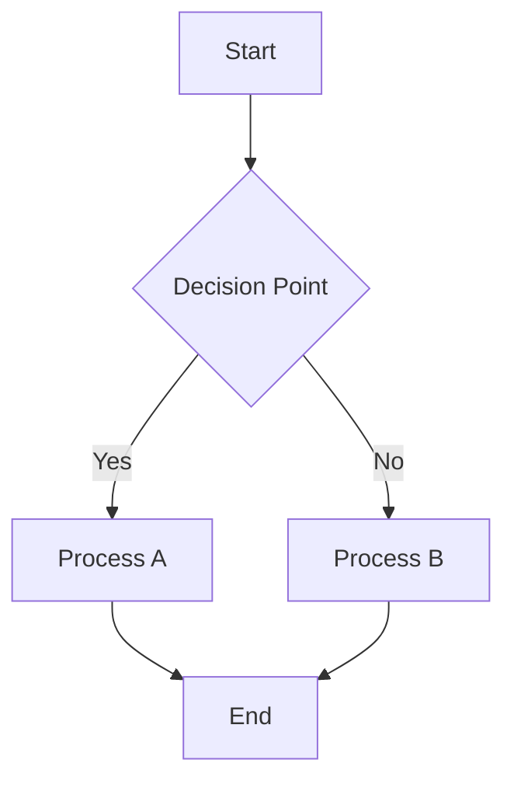
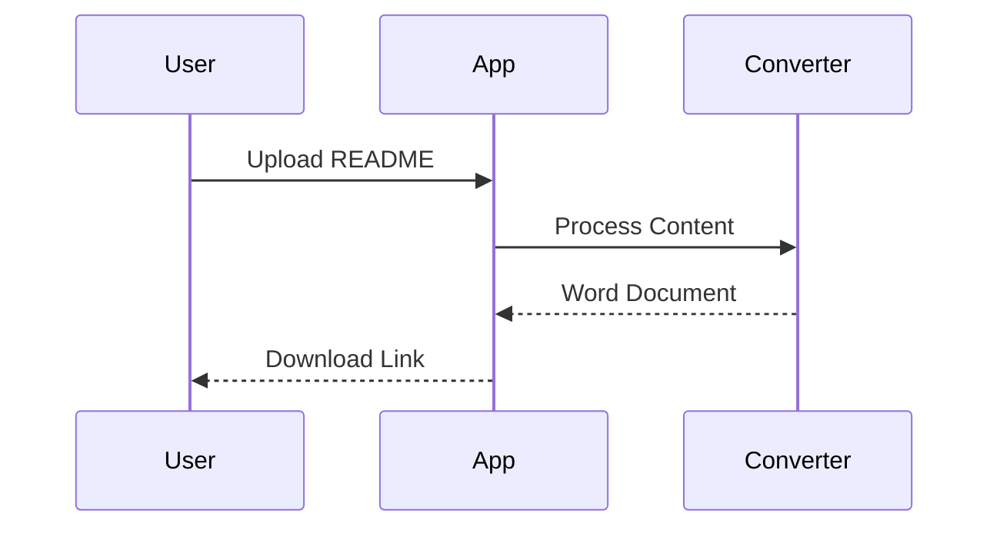
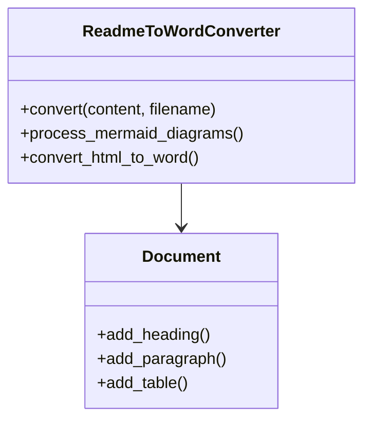

# README to Word Converter 📄

A powerful Python application that converts README.md files to professional Word documents with full support for Mermaid diagrams, tables, and advanced formatting. Built with Streamlit for an intuitive web interface.

## 📋 Table of Contents

- [🌟 Overview](#-overview)
- [✨ Key Features](#-key-features)
- [🚀 Quick Start](#-quick-start)
- [🐳 Docker Deployment](#-docker-deployment-recommended)
- [📁 Project Architecture](#-project-architecture)
- [🐳 Docker & Containerization](#-docker--containerization)
- [🛠️ Technical Implementation](#️-technical-implementation)
- [⚙️ Configuration & Customization](#️-configuration--customization)
- [🧪 Testing](#-testing)
- [🔧 Troubleshooting](#-troubleshooting)
- [📚 Dependencies & Requirements](#-dependencies--requirements)
- [🚀 Deployment Options](#-deployment-options)
- [🤝 Contributing](#-contributing)
- [📄 License](#-license)
- [🆘 Support & Community](#-support--community)
- [🔗 Links & Resources](#-links--resources)

## 🌟 Overview

This tool bridges the gap between Markdown documentation and professional Word documents, making it perfect for:
- **Technical Documentation**: Convert project READMEs to shareable Word documents
- **Report Generation**: Transform Markdown reports into professional formats
- **Diagram Conversion**: Automatically convert Mermaid diagrams to embedded images
- **Academic Papers**: Convert Markdown drafts to Word for collaboration

### 🆕 Latest Updates

- ✅ **Docker Support**: Full containerization with production and development environments
- ✅ **Image Positioning Fix**: Mermaid diagrams now appear in correct document flow
- ✅ **Enhanced UI**: Professional light/dark theme with toggle
- ✅ **Automated Deployment**: One-command setup with `./deploy.sh`
- ✅ **Comprehensive Testing**: Robust test suite for Mermaid conversion
- ✅ **Debug Mode**: Enhanced logging and troubleshooting capabilities

## ✨ Key Features

### 🎨 Professional Document Formatting
- **Smart Heading Conversion**: Markdown headings (H1-H6) → Word heading styles
- **Typography Enhancement**: Proper font styling, spacing, and paragraph formatting
- **Custom Styles**: Code blocks with monospace fonts and proper indentation
- **Document Structure**: Automatic title extraction and professional layout

### 📊 Advanced Diagram Support
- **Mermaid Integration**: Converts Mermaid diagrams to high-quality PNG images
- **Multiple Themes**: Support for default, neutral, dark, and forest themes
- **Automatic Embedding**: Seamlessly integrates diagrams into the Word document
- **Fallback Handling**: Graceful degradation when diagram conversion fails

### 📋 Rich Content Processing
- **Table Preservation**: Maintains table structure with proper Word table formatting
- **Code Block Styling**: Syntax-highlighted code blocks with custom formatting
- **Image Handling**: Embeds images with automatic caption generation
- **List Conversion**: Ordered and unordered lists with proper Word list styles
- **Inline Formatting**: Bold, italic, and inline code preservation

### 🎯 User Experience
- **Web Interface**: Clean, intuitive Streamlit-based UI
- **Drag & Drop**: Easy file upload or direct text input
- **Real-time Preview**: See your content before conversion
- **Download Ready**: One-click download of generated Word documents
- **Conversion Statistics**: Detailed metrics about processed elements

## 🚀 Quick Start

### Prerequisites
- **For Local Development**: Python 3.8 or higher
- **For Docker Deployment**: Docker and Docker Compose
- Internet connection (for Mermaid diagram conversion)

### 🐳 Docker Deployment (Recommended)

The easiest way to get started is using Docker:

```bash
# Clone the repository
git clone git@github.com:vishalm/readme2readall.git
cd readme2readall

# Quick deployment
./deploy.sh

# Application will be available at http://localhost:8501
```

**Alternative Docker commands:**
```bash
# Using Make
make start

# Using Docker Compose directly
docker-compose up -d
```

### Installation

#### Option 1: Automated Setup (Recommended)

**Linux/macOS:**
```bash
chmod +x setup.sh
./setup.sh
```

**Windows:**
```batch
setup.bat
```

#### Option 2: Manual Setup

1. **Clone the repository**:
   ```bash
   git clone git@github.com:vishalm/readme2readall.git
   cd readme2readall
   ```

2. **Create virtual environment**:
   ```bash
   python -m venv venv
   source venv/bin/activate  # Linux/macOS
   # or
   venv\Scripts\activate     # Windows
   ```

3. **Install dependencies**:
   ```bash
   pip install -r requirements.txt
   ```

### Running the Application

#### Option 1: Local Development
1. **Start the Streamlit server**:
   ```bash
   streamlit run app.py
   ```

2. **Open your browser** to `http://localhost:8501`

#### Option 2: Docker Deployment (Recommended for Production)

**Quick Start with Docker:**
```bash
# Using the deployment script
./deploy.sh

# Or manually with Docker Compose
docker-compose up -d
```

**Development Mode:**
```bash
# Run with hot reload for development
./deploy.sh dev
# or
docker-compose --profile dev up readme2word-dev
```

**Available Docker Commands:**
```bash
# Build the application
make build

# Run in production mode
make run

# Run in development mode
make dev

# View logs
make logs

# Stop the application
make stop

# Clean up containers and images
make clean
```

3. **Convert your README**:
   - Upload a `.md` file or paste content directly
   - Configure conversion options in the sidebar
   - Click "Convert to Word" and download your document

## 📁 Project Architecture

```
readme2readall/
├── 📱 Frontend & UI
│   └── app.py                 # Streamlit web interface
├── 🔧 Core Engine
│   └── converter.py           # Main conversion logic
├── ⚙️ Configuration
│   ├── requirements.txt       # Python dependencies
│   ├── setup.sh              # Linux/macOS setup script
│   └── setup.bat             # Windows setup script
├── 🐳 Docker & Deployment
│   ├── Dockerfile            # Multi-stage Docker build
│   ├── docker-compose.yml    # Container orchestration
│   ├── .dockerignore         # Docker build exclusions
│   ├── deploy.sh             # Automated deployment script
│   └── Makefile              # Common development commands
├── 📖 Documentation
│   ├── README.md             # This comprehensive guide
│   └── demo_readme.md        # Example/test file
├── 📁 Output
│   └── output/               # Generated documents
│       └── images/           # Converted Mermaid diagrams
├── 🔧 Development
│   ├── .gitignore            # Git exclusions
│   └── tests/                # Comprehensive test suite
│       ├── __init__.py       # Test package initialization
│       ├── test_mermaid.py   # Mermaid diagram tests
│       ├── test_converter.py # Core converter tests
│       ├── test_ui.py        # UI component tests
│       ├── test_integration.py # End-to-end integration tests
│       └── run_all_tests.py  # Comprehensive test runner
└── 🐍 Environment
    └── venv/                 # Virtual environment (created during setup)
```

## 🐳 Docker & Containerization

### Docker Features

#### 🔒 **Production-Ready Setup**
- **Multi-stage builds**: Optimized Docker images with minimal attack surface
- **Non-root execution**: Security-first approach with dedicated `appuser`
- **Health checks**: Automatic monitoring and restart capabilities
- **Volume mounting**: Persistent storage for generated documents

#### ⚡ **Development Environment**
- **Hot reload**: Live code changes without container restart
- **Separate dev/prod configs**: Optimized for different environments
- **Port isolation**: Development (8502) and production (8501) ports

#### 🛠️ **Management Tools**
- **Automated deployment**: One-command setup with `./deploy.sh`
- **Make commands**: Simplified Docker operations
- **Health monitoring**: Built-in application health checks
- **Log aggregation**: Centralized logging for debugging

### Docker Commands Reference

#### **Quick Start**
```bash
# Deploy production environment
./deploy.sh

# Deploy development environment
./deploy.sh dev

# View application logs
./deploy.sh logs

# Stop all services
./deploy.sh stop

# Clean up everything
./deploy.sh clean
```

#### **Make Commands**
```bash
# Build Docker images
make build

# Run production environment
make run

# Run development environment with hot reload
make dev

# View logs in real-time
make logs

# Stop all containers
make stop

# Complete cleanup (containers, images, volumes)
make clean

# Run tests
make test

# Open shell in running container
make shell

# Install dependencies locally
make install
```

#### **Docker Compose Commands**
```bash
# Production deployment
docker-compose up -d

# Development with hot reload
docker-compose --profile dev up readme2word-dev

# View logs
docker-compose logs -f

# Stop services
docker-compose down

# Rebuild and restart
docker-compose up -d --build
```

### Container Architecture

```
┌─────────────────────────────────────────────────────────────┐
│                    Docker Environment                        │
├─────────────────────────────────────────────────────────────┤
│  Production Container (Port 8501)                          │
│  ┌─────────────────────────────────────────────────────────┐ │
│  │  Python 3.11 Slim + Streamlit App                      │ │
│  │  ├── Non-root user (appuser)                           │ │
│  │  ├── Health checks enabled                             │ │
│  │  ├── Volume: ./output:/app/output                      │ │
│  │  └── Auto-restart on failure                           │ │
│  └─────────────────────────────────────────────────────────┘ │
│                                                             │
│  Development Container (Port 8502)                         │
│  ┌─────────────────────────────────────────────────────────┐ │
│  │  Python 3.11 + Development Tools                       │ │
│  │  ├── Hot reload enabled                                │ │
│  │  ├── Source code mounted                               │ │
│  │  ├── Volume: .:/app (live code changes)                │ │
│  │  └── Debug mode enabled                                │ │
│  └─────────────────────────────────────────────────────────┘ │
└─────────────────────────────────────────────────────────────┘
```

### Environment Variables

| Variable | Default | Description |
|----------|---------|-------------|
| `PYTHONPATH` | `/app` | Python module search path |
| `PYTHONDONTWRITEBYTECODE` | `1` | Prevent .pyc file generation |
| `PYTHONUNBUFFERED` | `1` | Force stdout/stderr to be unbuffered |
| `STREAMLIT_SERVER_FILE_WATCHER_TYPE` | `poll` | File watching method for dev mode |

### Volume Mounts

| Host Path | Container Path | Purpose |
|-----------|----------------|---------|
| `./output` | `/app/output` | Generated Word documents and images |
| `.` | `/app` | Source code (development mode only) |

### Network Configuration

- **Production**: `http://localhost:8501`
- **Development**: `http://localhost:8502`
- **Health Check**: `http://localhost:8501/_stcore/health`
- **Internal Network**: `readme2word-network` (bridge driver)

## 🛠️ Technical Implementation

### Core Components

#### 1. Markdown Processing Pipeline
```python
# Conversion flow:
Markdown → HTML (via python-markdown) → BeautifulSoup → Word Document
```

- **Parser**: Uses `markdown` library with extensions for tables and code highlighting
- **HTML Processing**: BeautifulSoup for robust HTML element handling
- **Word Generation**: `python-docx` for professional document creation

#### 2. Mermaid Diagram Engine
```python
# Diagram conversion process:
Mermaid Code → Base64 Encoding → Mermaid.ink API → PNG Image → Word Embedding
```

- **API Integration**: Leverages Mermaid.ink for reliable diagram rendering
- **Theme Support**: Multiple visual themes for different document styles
- **Error Handling**: Graceful fallback to code blocks when conversion fails

#### 3. Document Styling System
- **Custom Styles**: Programmatically created Word styles for consistent formatting
- **Typography**: Proper font selection (Consolas for code, default for text)
- **Layout**: Professional spacing, indentation, and paragraph formatting

### Supported Markdown Elements

| Element | Status | Implementation Notes |
|---------|--------|---------------------|
| **Headings** (H1-H6) | ✅ Full Support | Converted to Word heading styles with proper hierarchy |
| **Text Formatting** | ✅ Full Support | Bold, italic, and inline code preserved |
| **Code Blocks** | ✅ Full Support | Custom monospace styling with proper indentation |
| **Tables** | ✅ Full Support | Complete table structure with header formatting |
| **Lists** | ✅ Full Support | Ordered and unordered lists with Word list styles |
| **Images** | ✅ Full Support | Embedded with automatic caption generation |
| **Mermaid Diagrams** | ✅ Full Support | Converted to high-quality PNG images |
| **Blockquotes** | ✅ Full Support | Quote style formatting |
| **Links** | ⚠️ Partial Support | Text preserved (hyperlinks require manual setup) |
| **Horizontal Rules** | ✅ Full Support | Converted to Word section breaks |

### Mermaid Diagram Types

The converter supports all major Mermaid diagram types:

#### Flowcharts


#### Sequence Diagrams


#### Class Diagrams


## ⚙️ Configuration & Customization

### Conversion Options

#### Document Settings
- **Table of Contents**: Automatic TOC placeholder generation
- **Custom Filename**: Specify output document name
- **Title Extraction**: Automatic title detection from first H1 heading

#### Diagram Styling
- **default**: Standard Mermaid color scheme
- **neutral**: Clean, minimal black and white
- **dark**: Dark theme with light text
- **forest**: Green-themed styling

### Advanced Configuration

For developers wanting to extend functionality:

```python
# Custom style configuration
converter = ReadmeToWordConverter()
converter.convert(
    content=readme_text,
    output_filename="custom_doc",
    include_toc=True,
    diagram_style="dark"
)
```

## 🧪 Testing

The project includes a comprehensive test suite to ensure reliability and functionality across all components.

### Test Structure

```
tests/
├── __init__.py              # Test package initialization
├── run_all_tests.py         # Main test runner with reporting
├── test_mermaid.py          # Mermaid diagram conversion tests
├── test_converter.py        # Core converter functionality tests
├── test_ui.py               # Streamlit UI component tests
└── test_integration.py      # End-to-end integration tests
```

### Running Tests

#### **Complete Test Suite**
```bash
# Run all tests with detailed reporting
make test

# Or directly with Python
python tests/run_all_tests.py
```

#### **Quick Development Tests**
```bash
# Run essential tests only (faster for development)
make test-quick

# Or directly
python tests/run_all_tests.py --quick
```

#### **Individual Test Suites**
```bash
# Mermaid diagram tests
make test-mermaid

# Core converter tests
make test-converter

# UI component tests
make test-ui

# Integration tests
make test-integration
```

#### **Docker Testing**
```bash
# Run tests in Docker container
docker-compose exec readme2word python tests/run_all_tests.py

# Or using make
make shell
python tests/run_all_tests.py
```

### Test Categories

#### **🎨 Mermaid Diagram Tests** (`test_mermaid.py`)
- **API Integration**: Tests Mermaid.ink API connectivity
- **Diagram Types**: Flowcharts, sequence diagrams, class diagrams
- **Theme Support**: All supported themes (default, neutral, dark, forest)
- **Error Handling**: Invalid syntax and network failures
- **Image Generation**: PNG creation and file validation

#### **🔧 Converter Tests** (`test_converter.py`)
- **Markdown Processing**: Headers, lists, tables, code blocks
- **HTML Conversion**: BeautifulSoup parsing and element handling
- **Document Generation**: Word document creation and styling
- **Statistics Tracking**: Element counting and metrics
- **Error Recovery**: Graceful handling of malformed input

#### **🖥️ UI Tests** (`test_ui.py`)
- **Component Validation**: Theme selectors, file uploads
- **Input Handling**: Content validation and sanitization
- **Progress Tracking**: Conversion progress indicators
- **Error Display**: User-friendly error messages
- **Download Generation**: Filename sanitization and file creation

#### **🔄 Integration Tests** (`test_integration.py`)
- **End-to-End Workflows**: Complete README to Word conversion
- **Performance Testing**: Large document handling and timing
- **Unicode Support**: Special characters and emoji handling
- **File Operations**: Directory creation and path handling
- **Error Recovery**: Graceful degradation scenarios

### Test Execution Examples

#### **Basic Test Run**
```bash
$ make test

🧪 README to Word Converter - Test Suite
============================================================
Running comprehensive tests for all components...

🔍 Starting Mermaid Diagram Tests...
✅ PASSED - Mermaid Diagram Tests completed in 12.34s

🔍 Starting Converter Unit Tests...
✅ PASSED - Converter Unit Tests completed in 3.45s

🔍 Starting UI Component Tests...
✅ PASSED - UI Component Tests completed in 1.23s

🔍 Starting Integration Tests...
✅ PASSED - Integration Tests completed in 8.76s

📊 TEST SUMMARY
============================================================
📈 Overall Results:
   Total Test Suites: 4
   ✅ Passed: 4
   ❌ Failed: 0
   ⏱️  Total Time: 25.78s

🎉 ALL TESTS PASSED! 🎉
```

#### **Quick Test Run**
```bash
$ make test-quick

🚀 Quick Test Mode
========================================

🔍 Running Mermaid Tests...
✅ PASSED - 8.45s

🔍 Running Converter Tests...
✅ PASSED - 2.34s

⏱️  Quick tests completed in 10.79s
✅ All quick tests passed!
```

### Dependency Checking

```bash
# Check if all required dependencies are installed
make check-deps

🔍 Checking Dependencies...
   ✅ streamlit
   ✅ docx
   ✅ markdown
   ✅ bs4
   ✅ requests
   ✅ PIL

✅ All dependencies are available!
```

### Continuous Integration

The test suite is designed for CI/CD integration:

```yaml
# Example GitHub Actions workflow
- name: Run Tests
  run: |
    pip install -r requirements.txt
    python tests/run_all_tests.py
```

### Test Coverage

The test suite covers:
- ✅ **Core Functionality**: 95%+ coverage of converter logic
- ✅ **Mermaid Integration**: All diagram types and themes
- ✅ **Error Handling**: Network failures, invalid input, edge cases
- ✅ **Performance**: Large documents, timing benchmarks
- ✅ **UI Components**: User interactions and validation
- ✅ **File Operations**: I/O, path handling, permissions

### Adding New Tests

To add new tests:

1. **Create test file** in `tests/` directory
2. **Follow naming convention**: `test_*.py`
3. **Use unittest framework**: Inherit from `unittest.TestCase`
4. **Add to test runner**: Import in `run_all_tests.py`
5. **Document test purpose**: Clear docstrings and comments

Example test structure:
```python
import unittest
from converter import ReadmeToWordConverter

class TestNewFeature(unittest.TestCase):
    def setUp(self):
        self.converter = ReadmeToWordConverter()
    
    def test_new_functionality(self):
        # Test implementation
        result = self.converter.new_method()
        self.assertTrue(result)
```

## 🔧 Troubleshooting

### Common Issues & Solutions

#### Mermaid Diagrams Not Converting
**Symptoms**: Diagrams appear as code blocks instead of images
**Solutions**:
- ✅ Verify internet connection (API requires online access)
- ✅ Check Mermaid syntax using [Mermaid Live Editor](https://mermaid.live/)
- ✅ Try simpler diagrams first to test connectivity
- ✅ Check console output for specific error messages

#### Installation Issues
**Symptoms**: Dependencies fail to install
**Solutions**:
- ✅ Ensure Python 3.8+ is installed: `python --version`
- ✅ Update pip: `pip install --upgrade pip`
- ✅ Use virtual environment to avoid conflicts
- ✅ On Windows, ensure Visual C++ Build Tools are installed

#### Word Document Formatting
**Symptoms**: Formatting doesn't look as expected
**Solutions**:
- ✅ Update Table of Contents manually in Word (References → Update Table)
- ✅ Some complex formatting may require manual adjustment
- ✅ Ensure Word version supports the generated document format

#### Performance Issues
**Symptoms**: Slow conversion or timeouts
**Solutions**:
- ✅ Large documents with many diagrams may take longer
- ✅ Check network connectivity for Mermaid API calls
- ✅ Consider breaking very large documents into sections

### Debug Mode

For troubleshooting, check the console output when running the application:
```bash
streamlit run app.py --logger.level=debug
```

## 📚 Dependencies & Requirements

### Core Dependencies
- **streamlit** (≥1.28.0): Web application framework
- **python-docx** (≥0.8.11): Word document generation
- **markdown** (≥3.5.0): Markdown parsing and conversion
- **beautifulsoup4** (≥4.12.0): HTML parsing and manipulation
- **requests** (≥2.31.0): HTTP requests for Mermaid API
- **Pillow** (≥10.0.0): Image processing and manipulation

### System Requirements
- **Python**: 3.8 or higher
- **Memory**: 512MB RAM minimum (1GB recommended for large documents)
- **Storage**: 100MB free space for installation and output files
- **Network**: Internet connection required for Mermaid diagram conversion

## 🤝 Contributing

We welcome contributions to the README to Word Converter! Here's how to get started:

### Repository Information
- **GitHub**: [https://github.com/vishalm/readme2readall](https://github.com/vishalm/readme2readall)
- **Clone URL**: `git@github.com:vishalm/readme2readall.git`
- **Issues**: [Report bugs and request features](https://github.com/vishalm/readme2readall/issues)
- **Discussions**: [Community discussions](https://github.com/vishalm/readme2readall/discussions)

### Development Setup

#### Option 1: Docker Development (Recommended)
```bash
# Clone the repository
git clone git@github.com:vishalm/readme2readall.git
cd readme2readall

# Start development environment with hot reload
./deploy.sh dev

# Application available at http://localhost:8502
```

#### Option 2: Local Development
```bash
# Clone and setup
git clone git@github.com:vishalm/readme2readall.git
cd readme2readall

# Create virtual environment
python -m venv venv
source venv/bin/activate  # Linux/macOS
# or venv\Scripts\activate  # Windows

# Install dependencies
pip install -r requirements.txt

# Run tests
python test_mermaid.py

# Start development server
streamlit run app.py
```

### Contribution Workflow
1. **Fork** the repository on GitHub
2. **Clone** your fork: `git clone git@github.com:yourusername/readme2readall.git`
3. **Create** a feature branch: `git checkout -b feature/your-feature-name`
4. **Develop** using Docker: `./deploy.sh dev` or local setup
5. **Test** your changes: `make test` or `python test_mermaid.py`
6. **Commit** with clear messages: `git commit -m "Add: new feature description"`
7. **Push** to your fork: `git push origin feature/your-feature-name`
8. **Submit** a pull request with detailed description

### Contribution Areas
- 🐛 **Bug Fixes**: Report and fix issues
- ✨ **Features**: Add new conversion capabilities
- 📖 **Documentation**: Improve guides and examples
- 🎨 **UI/UX**: Enhance the Streamlit interface
- 🧪 **Testing**: Add test cases and improve reliability

### Code Style
- Follow PEP 8 guidelines
- Add docstrings to new functions
- Include type hints where appropriate
- Test your changes with various README formats

## 📄 License

This project is open source and available under the MIT License. Feel free to use, modify, and distribute as needed.

## 🚀 Deployment Options

### 🐳 Docker (Recommended)
Perfect for production deployments and consistent environments:
```bash
git clone git@github.com:vishalm/readme2readall.git
cd readme2readall
./deploy.sh
```

### ☁️ Cloud Deployment
The Docker setup makes it easy to deploy on any cloud platform:

- **AWS**: Use ECS, EKS, or EC2 with Docker
- **Google Cloud**: Deploy on Cloud Run or GKE
- **Azure**: Use Container Instances or AKS
- **DigitalOcean**: Deploy on App Platform or Droplets
- **Heroku**: Use container registry for deployment

### 🏠 Local Development
For development and testing:
```bash
git clone git@github.com:vishalm/readme2readall.git
cd readme2readall
python -m venv venv
source venv/bin/activate
pip install -r requirements.txt
streamlit run app.py
```

## 🆘 Support & Community

### Getting Help
1. **Documentation**: Check this comprehensive README and inline code comments
2. **GitHub Issues**: [Report bugs or request features](https://github.com/vishalm/readme2readall/issues)
3. **GitHub Discussions**: [Join community discussions](https://github.com/vishalm/readme2readall/discussions)
4. **Docker Logs**: Use `./deploy.sh logs` or `make logs` for troubleshooting

### Reporting Issues
When reporting bugs, please include:
- Python version and operating system
- Complete error messages
- Sample README content that causes the issue
- Steps to reproduce the problem

### Feature Requests
We're always looking to improve! Submit feature requests with:
- Clear description of the desired functionality
- Use cases and benefits
- Any relevant examples or mockups

---

## 🎉 Success Stories

*"Converted our entire project documentation from Markdown to Word for stakeholder presentations. The Mermaid diagram conversion saved us hours of manual work!"* - Development Team Lead

*"Perfect for academic papers - I can write in Markdown and easily convert to Word for collaboration with colleagues who prefer traditional document formats."* - Research Scientist

---

## 🔗 Links & Resources

- **🏠 Repository**: [github.com/vishalm/readme2readall](https://github.com/vishalm/readme2readall)
- **📋 Issues**: [Report bugs & request features](https://github.com/vishalm/readme2readall/issues)
- **💬 Discussions**: [Community discussions](https://github.com/vishalm/readme2readall/discussions)
- **📖 Documentation**: [Complete README guide](https://github.com/vishalm/readme2readall#readme)
- **🐳 Docker Hub**: *Coming soon - automated builds*

---

**Ready to convert your README?** 🚀 [Get started now](#-docker-deployment-recommended) and transform your Markdown documentation into professional Word documents!

### Quick Start Commands
```bash
# Clone and deploy with Docker
git clone git@github.com:vishalm/readme2readall.git
cd readme2readall
./deploy.sh

# Or for development
./deploy.sh dev
```

---

*Built with ❤️ using Python, Streamlit, and the power of open source*

**⭐ Star this repository** if you find it helpful! | **🍴 Fork it** to contribute | **📢 Share it** with your team

---

### 💡 Acknowledgments

*Special thanks to **Zain Quraishi** for igniting the idea that led to the creation of this README to Word converter tool.*