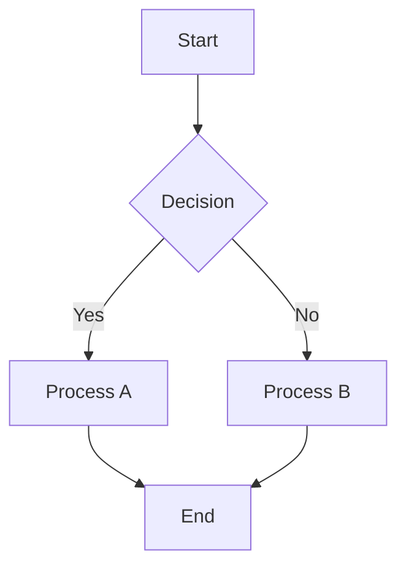
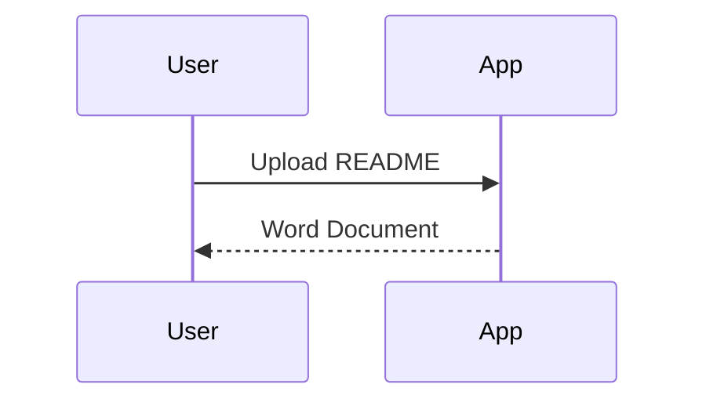

# README to Word Converter

[](https://badge.fury.io/py/readme2word)
[](https://www.python.org/downloads/)
[](https://opensource.org/licenses/MIT)

A powerful Python package that converts README.md files to professional Word documents with full support for Mermaid diagrams, tables, and advanced formatting.

## ✨ Features

- 📄 **Markdown to Word**: Convert README.md files to professional .docx documents
- 🎨 **Mermaid Diagrams**: Automatic conversion of Mermaid diagrams to embedded images
- 📊 **Rich Content**: Tables, code blocks, images, and formatting preservation
- 🖥️ **Web Interface**: Beautiful Streamlit-based UI with light/dark themes
- 🔧 **CLI Tool**: Command-line interface for batch processing
- 🐳 **Docker Ready**: Complete containerization support
- ☸️ **Kubernetes**: Production-ready Helm charts included

## 🚀 Quick Start

### Installation

```bash
# Install from PyPI
pip install readme2word

# Install with all extras (recommended)
pip install readme2word[all]

# Install for development
pip install readme2word[dev]
```

### Command Line Usage

```bash
# Convert README.md to Word document
readme2word README.md

# Convert with custom output name
readme2word README.md -o report.docx

# Use dark theme for diagrams
readme2word README.md --theme dark

# Enable debug mode
readme2word README.md --debug

# Launch web interface
readme2word --web
```

### Python API Usage

```python
from readme2word import ReadmeToWordConverter

# Initialize converter
converter = ReadmeToWordConverter()

# Convert markdown content
with open('README.md', 'r') as f:
    content = f.read()

success = converter.convert(
    content=content,
    output_filename='output.docx',
    include_toc=True,
    diagram_style='default'
)

if success:
    print("✅ Conversion completed!")
```

### Web Interface

```bash
# Launch web interface
readme2word --web

# Or using Python
python -m readme2word.web
```

Then open your browser to `http://localhost:8501`

## 🎨 Mermaid Diagram Support

The converter automatically detects and converts Mermaid diagrams:

### Flowcharts


### Sequence Diagrams


### Supported Themes
- `default` - Standard Mermaid colors
- `neutral` - Clean black and white
- `dark` - Dark theme with light text
- `forest` - Green-themed styling

## 📦 Installation Options

### Basic Installation
```bash
pip install readme2word
```

### With Optional Dependencies
```bash
# Development tools
pip install readme2word[dev]

# Docker support
pip install readme2word[docker]

# Kubernetes support
pip install readme2word[kubernetes]

# Everything
pip install readme2word[all]
```

## 🔧 CLI Reference

```
usage: readme2word [-h] [-o OUTPUT] [--theme {default,neutral,dark,forest}] 
                   [--debug] [--no-toc] [--web] [--version] [input_file]

Convert README.md files to professional Word documents

positional arguments:
  input_file            Input README.md file to convert

optional arguments:
  -h, --help            show this help message and exit
  -o OUTPUT, --output OUTPUT
                        Output Word document filename
  --theme {default,neutral,dark,forest}
                        Mermaid diagram theme (default: default)
  --debug               Enable debug mode with verbose logging
  --no-toc              Disable table of contents generation
  --web                 Launch web interface instead of CLI conversion
  --version             show program's version number and exit
```

## 🐳 Docker Usage

```bash
# Pull from Docker Hub (when available)
docker pull readme2word:latest

# Run web interface
docker run -p 8501:8501 readme2word

# Convert files with volume mount
docker run -v $(pwd):/workspace readme2word readme2word /workspace/README.md
```

## ☸️ Kubernetes Deployment

```bash
# Using Helm (requires cloning repository)
git clone https://github.com/vishalm/readme2readall.git
cd readme2readall
helm install readme2word ./infra/helm/readme2word
```

## 📚 Examples

### Basic Conversion
```bash
readme2word README.md
```

### Custom Output and Theme
```bash
readme2word README.md -o technical-report.docx --theme dark
```

### Batch Processing
```bash
for file in *.md; do
    readme2word "$file" -o "${file%.md}.docx"
done
```

### Python Script
```python
import os
from readme2word import ReadmeToWordConverter

converter = ReadmeToWordConverter()

# Process all markdown files in directory
for filename in os.listdir('.'):
    if filename.endswith('.md'):
        with open(filename, 'r') as f:
            content = f.read()
        
        output_name = filename.replace('.md', '.docx')
        converter.convert(content, output_name)
        print(f"Converted {filename} → {output_name}")
```

## 🔧 Configuration

### Environment Variables
- `DEBUG`: Enable debug mode
- `MERMAID_THEME`: Default Mermaid theme
- `OUTPUT_DIR`: Default output directory

### Streamlit Configuration
The web interface can be configured via `.streamlit/config.toml`:

```toml
[server]
port = 8501
headless = true

[theme]
primaryColor = "#1f77b4"
backgroundColor = "#ffffff"
```

## 🧪 Development

### Local Development Setup
```bash
# Clone repository
git clone https://github.com/vishalm/readme2readall.git
cd readme2readall

# Install in development mode
pip install -e .[dev]

# Run tests
pytest tests/

# Run web interface
streamlit run app.py
```

### Building from Source
```bash
# Install build tools
pip install build twine

# Build package
python -m build

# Check package
twine check dist/*
```

## 📋 Requirements

- **Python**: 3.8 or higher
- **Dependencies**: 
  - streamlit >= 1.28.0
  - python-docx >= 0.8.11
  - markdown >= 3.5.0
  - beautifulsoup4 >= 4.12.0
  - requests >= 2.31.0
  - Pillow >= 10.0.0

## 🐛 Troubleshooting

### Common Issues

**Mermaid diagrams not converting:**
- Ensure internet connection (requires mermaid.ink API)
- Check diagram syntax at [Mermaid Live Editor](https://mermaid.live/)

**Installation issues:**
- Update pip: `pip install --upgrade pip`
- Use virtual environment: `python -m venv venv && source venv/bin/activate`

**Permission errors:**
- Use `--user` flag: `pip install --user readme2word`

### Debug Mode
```bash
readme2word README.md --debug
```

## 📄 License

This project is licensed under the MIT License - see the [LICENSE](https://github.com/vishalm/readme2readall/blob/main/LICENSE) file for details.

## 🤝 Contributing

Contributions are welcome! Please see our [Contributing Guide](https://github.com/vishalm/readme2readall#contributing) for details.

## 🔗 Links

- **GitHub**: [https://github.com/vishalm/readme2readall](https://github.com/vishalm/readme2readall)
- **PyPI**: [https://pypi.org/project/readme2word/](https://pypi.org/project/readme2word/)
- **Issues**: [https://github.com/vishalm/readme2readall/issues](https://github.com/vishalm/readme2readall/issues)
- **Documentation**: [Complete README](https://github.com/vishalm/readme2readall#readme)

## 🙏 Acknowledgments

Special thanks to **Zain Quraishi** for inspiring the idea that led to this project.

---

**⭐ Star the project** on GitHub if you find it helpful!

**📦 Install now**: `pip install readme2word` 