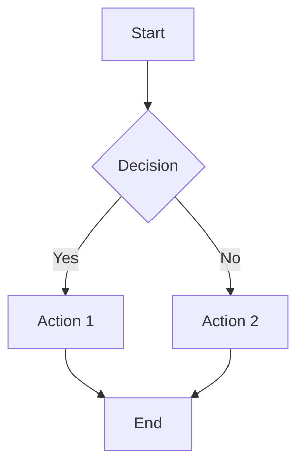
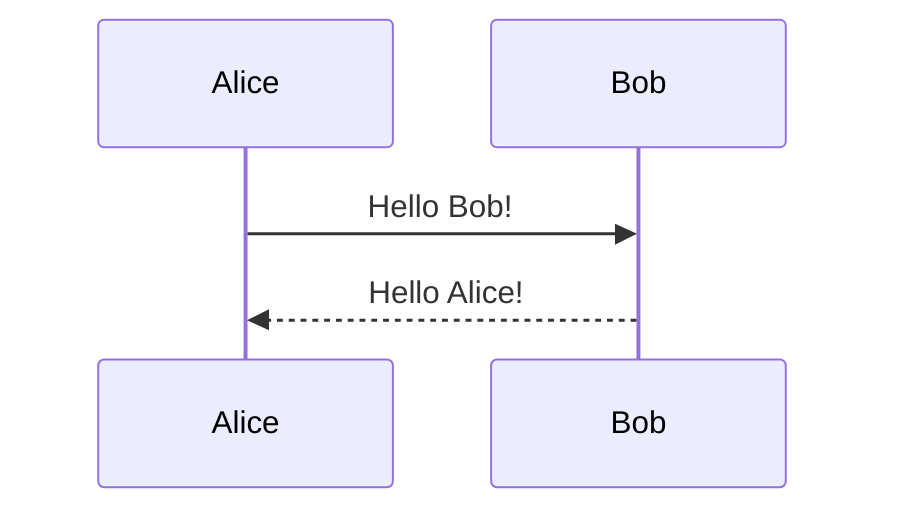
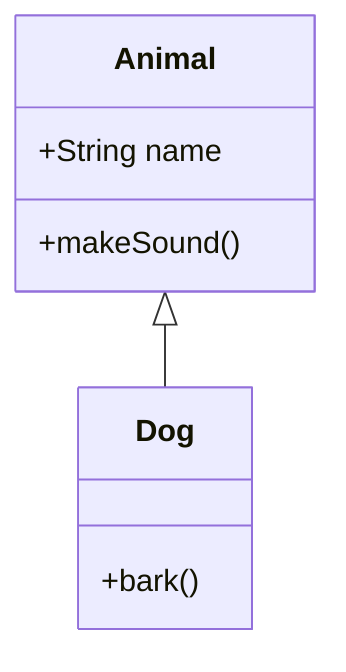

# README to Word Converter 📄

A powerful Python application that converts README.md files to professional Word documents with full support for Mermaid diagrams, tables, and proper formatting.

## ✨ Features

- **🎨 Professional Formatting**: Converts Markdown headings, tables, and text to proper Word styles
- **📊 Mermaid Diagram Support**: Automatically converts Mermaid diagrams to images
- **📋 Table Conversion**: Preserves table structure and formatting
- **💻 Code Block Handling**: Properly formats code blocks with monospace fonts
- **🖼️ Image Support**: Handles images and generates captions
- **📑 Table of Contents**: Optional automatic TOC generation
- **🎯 Easy-to-Use UI**: Clean Streamlit interface for simple operation

## 🚀 Quick Start

### Installation

1. **Clone or download the project files**
2. **Install dependencies**:
   ```bash
   pip install -r requirements.txt
   ```

### Running the Application

1. **Start the Streamlit app**:
   ```bash
   streamlit run app.py
   ```

2. **Open your browser** to `http://localhost:8501`

3. **Upload your README.md** or paste the content

4. **Configure options** in the sidebar:
   - Include Table of Contents
   - Choose diagram style (default, neutral, dark, forest)

5. **Click "Convert to Word"** and download your document!

## 📁 Project Structure

```
readme-to-word-converter/
├── app.py              # Main Streamlit application
├── converter.py        # Core conversion logic
├── requirements.txt    # Python dependencies
├── README.md          # This file
├── demo_readme.md     # Example file for testing
├── setup.sh           # Linux/Mac setup script
├── setup.bat          # Windows setup script
└── output/            # Generated Word documents and images
    └── images/        # Converted Mermaid diagrams
```

## 🛠️ How It Works

### Markdown Processing
- Parses Markdown using the `markdown` library
- Converts HTML to Word document elements
- Preserves formatting for headings, lists, tables, and code blocks

### Mermaid Diagram Conversion
- Detects Mermaid code blocks with ` ```mermaid ` syntax
- Uses the Mermaid.ink API to convert diagrams to PNG images
- Embeds images directly into the Word document

### Word Document Generation
- Uses `python-docx` to create professional Word documents
- Applies proper styles for different content types
- Generates table of contents (requires manual update in Word)

## 📝 Supported Markdown Features

| Feature | Support | Notes |
|---------|---------|-------|
| Headings (H1-H6) | ✅ | Converted to Word heading styles |
| **Bold Text** | ✅ | Preserved in Word |
| *Italic Text* | ✅ | Preserved in Word |
| `Inline Code` | ✅ | Uses monospace font |
| Code Blocks | ✅ | Custom code block style |
| Tables | ✅ | Full table formatting |
| Lists (ordered/unordered) | ✅ | Word list styles |
| Images | ✅ | Embedded with captions |
| Links | ⚠️ | Text preserved (hyperlinks need manual setup) |
| Mermaid Diagrams | ✅ | Converted to images |
| Blockquotes | ✅ | Quote style applied |

## 🎨 Mermaid Diagram Support

The converter supports all Mermaid diagram types:

### Flowcharts


### Sequence Diagrams


### Class Diagrams


## ⚙️ Configuration Options

### Diagram Styles
- **default**: Standard Mermaid styling
- **neutral**: Clean, minimal look
- **dark**: Dark theme
- **forest**: Green-themed styling

### Document Options
- **Table of Contents**: Automatically generate TOC placeholder
- **Custom Filename**: Specify output document name

## 🔧 Troubleshooting

### Common Issues

**Mermaid diagrams not converting:**
- Check internet connection (requires API access)
- Verify Mermaid syntax is correct
- Try a simpler diagram first

**Images not displaying:**
- Ensure image paths are accessible
- Check image file formats (PNG, JPG supported)

**Word document formatting issues:**
- Some complex formatting may need manual adjustment
- Update Table of Contents manually in Word (References → Update Table)

## 📚 Dependencies

- **streamlit**: Web UI framework
- **python-docx**: Word document generation
- **markdown**: Markdown parsing
- **beautifulsoup4**: HTML parsing
- **requests**: HTTP requests for Mermaid API
- **Pillow**: Image processing

## 🤝 Contributing

Feel free to contribute improvements:

1. Fork the project
2. Create a feature branch
3. Make your changes
4. Submit a pull request

## 📄 License

This project is open source. Feel free to use and modify as needed.

## 🆘 Support

If you encounter issues:
1. Check the troubleshooting section
2. Verify all dependencies are installed
3. Test with a simple README first
4. Check the console for error messages

---

**Happy converting!** 🎉